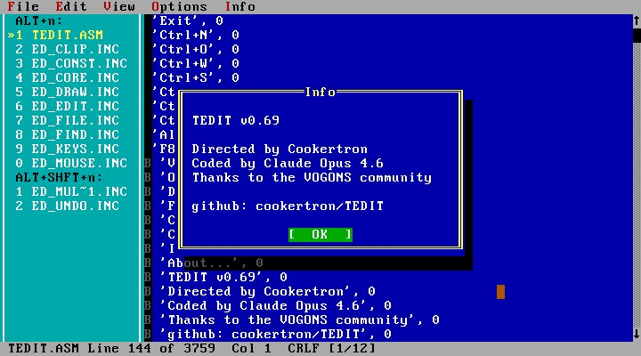

# TEDIT



A multi-document text editor for DOS, written entirely in 8086 assembly language.

TEDIT is built on a custom TUI (Text User Interface) framework with support for
up to 8 simultaneous open files, a document side panel, project files, and
disk-based document swapping. It targets real-mode DOS as a `.COM` binary and
runs on IBM PC compatibles, DOSBox-X, and the agent86 emulator.

## Screenshot

Run in DOSBox-X or agent86 with CGA 80-column text mode:

```
 File  Edit  Info
The quick brown fox jumps over the lazy dog.
This is line two of the document.

 myfile.txt Line 1 of 3  Col 1
```

## Features

### Editing
- Full keyboard text editing (insert, delete, backspace, enter)
- Insert and overwrite modes (Insert key to toggle, `[OVR]` indicator)
- Tab key inserts literal tab characters with configurable display width
  (`/t 2`, `/t 4`, `/t 8` command-line flag; default 8)
- Horizontal scrolling for lines longer than 80 columns
- Tab-aware rendering with correct tab stop alignment

### Selection
- Shift+Arrow/Home/End/PgUp/PgDn for keyboard selection
- Mouse click and drag selection with auto-scroll
- Selection grace period prevents accidental deselection on Shift release
- Type, Delete, or Backspace replaces selection

### Clipboard
- Cut (Ctrl+X), Copy (Ctrl+C), Paste (Ctrl+V)
- Internal clipboard (16 KB buffer)

### Undo/Redo
- Ctrl+Z to undo, Ctrl+Shift+Z to redo
- 32 KB undo buffer (~3,276 records)
- Grouped undo for consecutive typing, overwrite sequences, and date/time insertion
- Smart dirty tracking (knows when file returns to saved state)

### Find & Replace
- Find (Ctrl+F) with custom dialog featuring checkboxes:
  - **Match case** toggle (case-sensitive or case-insensitive search)
  - **In selection** toggle (restrict search to multi-line selection)
- Find Next (F3), Find Prev (Shift+F3)
- Replace (Ctrl+H) with custom dialog:
  - **Match case**, **In selection**, and **Replace all** checkboxes
  - Interactive replace: per-match Yes/No/All/Cancel confirmation
  - Small batches (50 or fewer matches): fully undoable
  - Large batches (over 50 matches): streaming single-pass replace for
    performance, with permanent save (warned before proceeding)
- Selection pre-fill: single-line selection populates the search field

### Multi-Document Editing
- Up to 8 files open simultaneously
- Disk-based document swapping — only the active document is in memory;
  inactive documents are saved to temporary swap files and restored on switch
- Document switching: Alt+1–8 (direct slot), F6 (next document),
  Ctrl+PgDn/PgUp (next/prev occupied slot)
- Side panel (F1 or View > Document List): shows all open documents with
  slot number, filename, dirty indicator, and arrow marker on the active
  document. Navigate with Up/Down arrows, Enter to switch, Esc to close.
  Drop shadow on the right edge
- Duplicate file prevention — opening an already-open file switches to it
- `[N/M]` status bar indicator when multiple documents are open

### Project Files
- Save Project (File > Save Project): writes all open file paths to a `.PRJ`
  file (one path per line, plain text — hand-editable)
- Load Project (File > Load Project): closes all current documents and opens
  every file listed in the `.PRJ` file
- Project files use `*.PRJ` wildcard filter in the file dialog

### File Operations
- New (Ctrl+N), Open (Ctrl+O) with Turbo Debugger-style file browser:
  - Separate Files and Directories listboxes
  - Filename text field with wildcard support (`*.txt`, `*.asm`, etc.)
  - Wildcard persistence between opens
  - Listbox double-click and Enter to open files
  - Drive selection dropdown and path display
- Save (Ctrl+S), Save As (Ctrl+Shift+S) with overwrite confirmation
- Save All (Ctrl+Alt+S) — saves all dirty, named documents
- Close (Ctrl+W) — single document resets to untitled; multiple documents
  switches to the next
- Close All (Ctrl+Alt+W) — prompts for each dirty document, resets to untitled
- Shell to DOS (File > Shell to DOS) — spawns interactive COMMAND.COM via
  COMSPEC; compatible with SHROOM utility for memory-efficient shelling
- Word Wrap (Edit > Word Wrap) — permanent hard wrap at 80 columns
- Go to Line (Ctrl+G)
- Date/Time insertion (F5) — inserts `YYYY-MM-DD HH:MM:SS` at cursor
- Working directory restored on exit

### Menu System
- File: New, Open, Close, Close All, Save, Save As, Save All, Load Project,
  Save Project, Shell to DOS, Quit
- Edit: Undo, Redo, Cut, Copy, Paste, Find, Find Next, Find Prev,
  Replace, Goto, Date/Time, Word Wrap
- View: Document List
- Info: About

## Building

TEDIT is assembled using **[agent86](https://github.com/cookertron/agent86)**,
a two-pass 8086 assembler and per-instruction JIT emulator targeting `.COM`
binaries. agent86 is a standalone Windows tool designed for agentic AI
workflows — all output is JSON on stdout, enabling automated build-test cycles.

See `manual.md` for the full agent86 reference.

### Assemble only

```
agent86 TEDIT.ASM
```

Produces `TEDIT.COM` (the editor binary) and `TEDIT.DBG` (debug symbols).

### Assemble and run

```
agent86 TEDIT.ASM --build_run --screen CGA80
```

### Run with a file

```
agent86 TEDIT.ASM --build_run --screen CGA80 --args "myfile.txt"
```

### Run with custom tab width

```
agent86 TEDIT.ASM --build_run --screen CGA80 --args "myfile.txt /t 4"
```

### Run in DOSBox-X

Copy `TEDIT.COM` to your DOSBox-X drive and run:

```
TEDIT myfile.txt
TEDIT myfile.txt /t 4
```

## Architecture

TEDIT is a `.COM` flat-model program (ORG 100h, all segments equal).
The binary is approximately 62 KB.

### Piece Table Document Model

Text is stored in a piece table — an append-only data structure where the
original file data and new edits live in separate buffers. Insertions and
deletions manipulate piece descriptors (source, offset, length) rather
than moving text. This gives efficient editing regardless of file size.

- Original buffer: file data loaded in 32 KB chunks (up to 1,024 chunks)
- Add buffer: 64 KB for new text
- Piece table: up to 4,096 piece descriptors
- Checkpoint table: 2,048 line-to-piece mappings for fast seeking

### Source Structure

| File | Purpose |
|------|---------|
| `TEDIT.ASM` | Main file: includes, menu data, handlers, BSS |
| `ed_const.inc` | All EQU constants |
| `ed_core.inc` | Piece table engine, cursor, scroll, argument parsing |
| `ed_edit.inc` | Insert, delete, save operations |
| `ed_undo.inc` | Undo/redo buffer and execution |
| `ed_file.inc` | File loading, compaction |
| `ed_sel.inc` | Selection management |
| `ed_clip.inc` | Clipboard (copy, cut, paste) |
| `ed_find.inc` | Find, replace, streaming replace |
| `ed_draw.inc` | Rendering, tab expansion, cursor, status bar, side panel |
| `ed_keys.inc` | Keyboard dispatch, side panel navigation |
| `ed_mouse.inc` | Mouse click and drag, side panel click |
| `ed_multidoc.inc` | Document table, swap out/in, switching, slot management |
| `TUI\tui.inc` | TUI framework (master include) |

### TUI Framework

The editor is built on a custom TUI library (`TUI\` directory) that provides:

- Shadow buffer compositing with VRAM blit
- Windowing with z-order, borders, titles, move, resize
- Control types: label, button, textbox, checkbox, radio, dropdown,
  listbox, text viewer, editor
- Menu bar with dropdown menus, hotkeys, and accelerators
- Modal dialog system (message box, confirm, input, file selector)
- Mouse support (click, drag, scroll bars)
- Full keyboard navigation (Tab focus cycling, Enter activation)

## What TEDIT Is Not

TEDIT is a deliberate exercise in minimalism — a text editor written in
pure 8086 assembly for real-mode DOS. There are things it does well and
things it intentionally does not attempt.

### Limitations

- **8 documents maximum.** Up to 8 files open at once via disk-based swapping.
- **No syntax highlighting.** All text renders in a single colour.
- **No line numbers** in the editing area (line/column shown in status bar).
- **No soft word wrap.** Lines display with horizontal scrolling. The Word
  Wrap feature permanently modifies the file (hard wrap).
- **64 KB add buffer.** Very long editing sessions without saving may fill the
  add buffer, triggering a save-and-reload compaction cycle.
- **4,096 piece limit.** Extremely fragmented documents (thousands of tiny
  edits without saving) may hit this. Save and reopen to consolidate.
- **File dialog shows max 128 files** and **32 directories** per listing.
  Directories with more entries silently truncate.
- **DOS 8.3 filenames.** Filename fields are limited to 13 characters
  (8.3 format). Long filename support is not available.
- **No paste redo.** Undoing a paste works, but redoing it is a no-op.
  This is a deliberate trade-off to prevent LIFO save buffer corruption.
- **No multi-level redo.** Redo is linear — new edits after undo discard the
  redo tail.
- **Replace All for large batches (>50 matches) is permanent.** The streaming
  replace bypasses the undo system for performance. A warning is shown.
- **80-column text mode required.** 40-column and MDA modes are rejected at
  startup. No graphics, no 132-column mode, no colour themes.
- **16-bit real mode.** Maximum addressable file size is bounded by available
  conventional memory (~576 KB for data segments).

### Not a bug, by design

- **No auto-save.** Save explicitly with Ctrl+S or File > Save.
- **No configuration file.** Tab width is set via command-line flag only.
- **Cursor is a colour block**, not a blinking underscore. This is the
  software cursor implemented via attribute manipulation.
- **Mouse cursor is attribute-inverted**, not a hardware cursor.

## Version History

See `CHANGELOG.md` for the full version history with detailed per-version
changes. The editor has been developed through 60 versions covering:

- Core editing and file I/O
- Piece table engine with checkpoint-accelerated seeking
- Full undo/redo with grouping and smart dirty tracking
- Keyboard and mouse selection
- Range delete with piece table surgery
- Clipboard operations
- Find and replace with case-insensitive and selection-scoped search
- Streaming replace for large batch operations
- Tab support with configurable width
- Insert/overwrite mode toggle
- Turbo Debugger-style file browser with wildcard filtering and double-click
- Word wrap, Go to Line, Date/Time insertion
- Multi-document editing with disk-based swapping (up to 8 files)
- Document side panel with navigation and drop shadow
- Project file load/save
- Shell to DOS with SHROOM compatibility

## Credits

- **Directed by** Cookertron
- **Coded by** Claude Opus 4.6
- **Assembler/Emulator:** [agent86](https://github.com/cookertron/agent86) (custom 8086 toolchain)
- **Thanks to** the VOGONS community for support and inspiration
- **Repository:** github.com/cookertron/TEDIT
